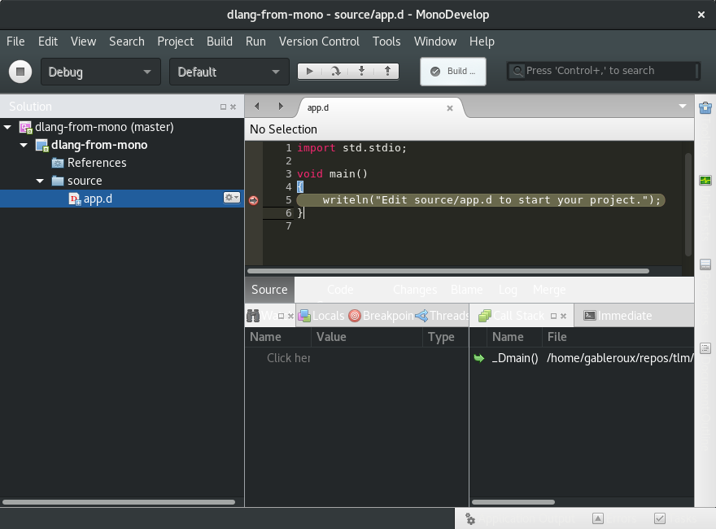

# Attempt to set a breakpoint on a D project using monodevelop

Well, integration is really uncool and it's not fun. At least I managed to get a breakpoint working

This works, but handling external libraries with `dub` seems to be a mess.

What I did:

1. Install [dlang](http://dlang.org/download.html#dmd) (I used "Install Script")
2. Install [Monodevelop](http://www.monodevelop.com/)
3. Install dlang addin from monodevelop (`Tools > Add-in Manager > search "D Language Binding"`. Oh and GDB may be handy too)
4. Create an empty dlang project
5. Run `dub init` in the folder that contains the `dproj` project file
6. Open project in monodevelop (if you installed dlang from script, open monodevelop with command line where you activated dlang so it can see `dmd` and `dub` commands)
7. Right click on your project, `Add existing folder`, select `source`
8. Run with debug (have your breakpoint ready). 

This worked for me, but it was a pain to figure this out. To have your dependencies loaded, you can double click the project (Project options), go to `Includes` and then manually add **every single dependecie's `source` folder**.

Don't enjoy.
